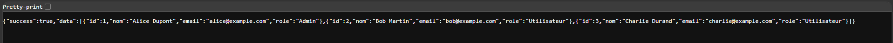
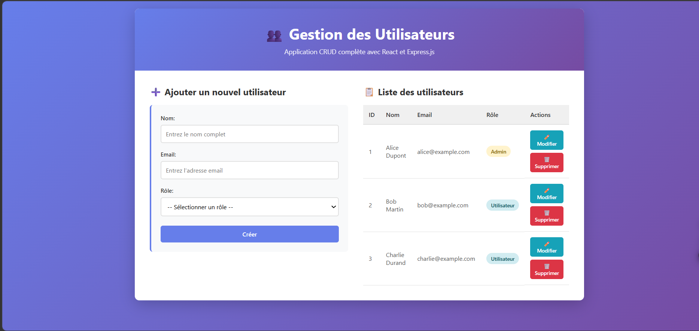
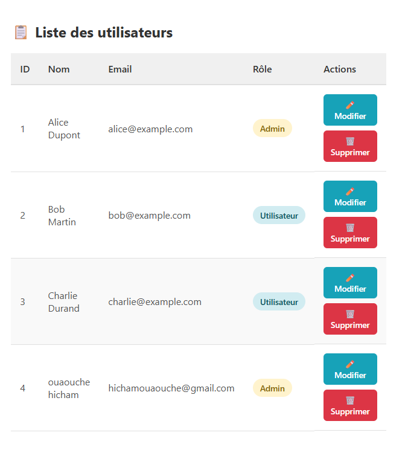
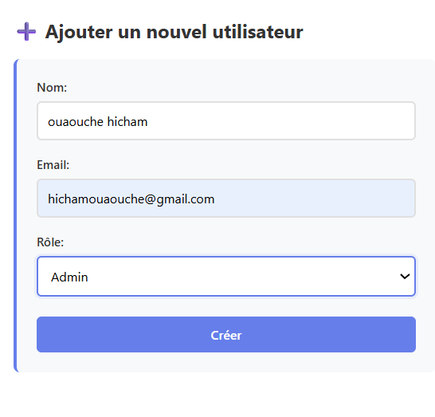
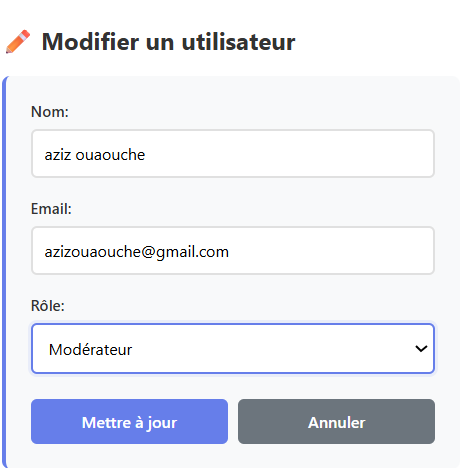
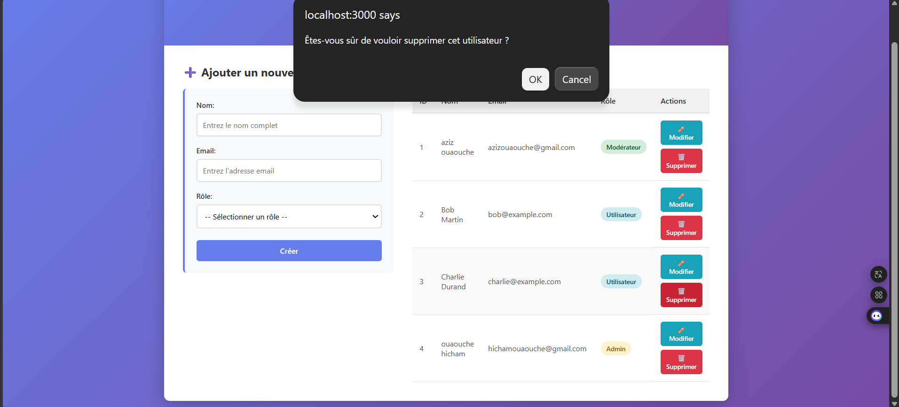

# Rapport de TP - Application CRUD de gestion des utilisateurs

## 1. Présentation du projet

Ce TP consiste à développer une application web simple de gestion des utilisateurs avec une architecture Full-Stack JavaScript. Le projet est séparé en deux parties:

- un back-end en Node.js avec Express.js
- un front-end en React.js

L'application permet d'effectuer les opérations CRUD classiques:

- créer un utilisateur
- afficher la liste des utilisateurs
- modifier un utilisateur
- supprimer un utilisateur

Les données sont stockées en mémoire dans un tableau JavaScript afin de garder un projet simple, rapide à comprendre et facile à tester.

## 2. Objectifs du TP

L'objectif principal est de réaliser une petite application complète en reliant un front-end React à une API REST Express. Le projet met en pratique:

- la création d'une API REST
- la gestion des requêtes HTTP
- l'utilisation de useEffect() pour charger les données au démarrage
- la gestion d'un formulaire unique pour l'ajout et la modification
- l'affichage d'une liste interactive avec actions de modification et suppression

## 3. Organisation du projet

La structure du projet est la suivante:

```text
Projet_tp/
├── backend/
│   ├── package.json
│   └── server.js
├── frontend/
│   ├── package.json
│   ├── public/
│   │   └── index.html
│   └── src/
│       ├── App.js
│       ├── App.css
│       └── index.js
├── images/
│   ├── backend.png
│   ├── interface.png
│   ├── liste.png
│   ├── ajoutee.png
│   ├── modifee.png
│   └── suprimer.png
└── README.md
```

## 4. Partie back-end

Le back-end est développé avec Express.js et écoute sur le port 5000. Il expose une API REST complète pour gérer les utilisateurs.

### Fonctionnement

- express.json() permet de lire les données envoyées au format JSON.
- cors autorise le front-end React à communiquer avec le serveur.
- Les utilisateurs sont stockés dans un tableau local en mémoire.
- Chaque utilisateur possède les champs suivants: id, nom, email, role.

### Routes disponibles

- GET /users pour récupérer tous les utilisateurs
- POST /users pour créer un utilisateur
- PUT /users/:id pour modifier un utilisateur
- DELETE /users/:id pour supprimer un utilisateur

### Capture du back-end

Cette image montre la réponse JSON renvoyée par l'API lors de l'appel à GET /users.



## 5. Partie front-end

Le front-end est développé avec React.js dans un seul composant principal: App.js.

### Fonctionnement

- useEffect() charge automatiquement les utilisateurs au démarrage.
- Un seul formulaire gère à la fois l'ajout et la modification.
- La liste des utilisateurs est affichée dans un tableau.
- Chaque ligne dispose de deux boutons: Modifier et Supprimer.
- Les actions de création, modification et suppression rafraîchissent la liste.

### Interface principale

Cette vue présente l'interface complète avec le formulaire à gauche et la liste des utilisateurs à droite.



### Liste des utilisateurs

La liste affiche les colonnes ID, Nom, Email, Rôle et Actions.



### Formulaire d'ajout

Le formulaire permet d'ajouter un nouvel utilisateur en remplissant le nom, l'email et le rôle.



### Formulaire de modification

Lorsque l'utilisateur clique sur Modifier, le formulaire passe en mode édition avec les valeurs préremplies.



### Suppression d'un utilisateur

La suppression affiche une boîte de dialogue de confirmation avant l'exécution de l'action.



## 6. Installation et lancement

### Prérequis

- Node.js installé sur la machine
- npm disponible dans le terminal

### Installation du back-end

```powershell
cd "f:\SDIA_S2\SDIA26_Web_Sémantique\Projet_tp\backend"
npm install
```

### Installation du front-end

```powershell
cd "f:\SDIA_S2\SDIA26_Web_Sémantique\Projet_tp\frontend"
npm install
```

### Lancement du back-end

```powershell
cd "f:\SDIA_S2\SDIA26_Web_Sémantique\Projet_tp\backend"
npm start
```

Le serveur démarre sur:

```text
http://localhost:5000
```

### Lancement du front-end

```powershell
cd "f:\SDIA_S2\SDIA26_Web_Sémantique\Projet_tp\frontend"
npm start
```

L'application React est accessible sur:

```text
http://localhost:3000
```

## 7. Endpoints de l'API

### Récupérer tous les utilisateurs

```http
GET http://localhost:5000/users
```

### Créer un utilisateur

```http
POST http://localhost:5000/users
Content-Type: application/json

{
  "nom": "Jean Martin",
  "email": "jean@example.com",
  "role": "Utilisateur"
}
```

### Modifier un utilisateur

```http
PUT http://localhost:5000/users/1
Content-Type: application/json

{
  "nom": "Jean Dupont",
  "email": "jean.dupont@example.com",
  "role": "Modérateur"
}
```

### Supprimer un utilisateur

```http
DELETE http://localhost:5000/users/1
```

## 8. Résultat obtenu

Le projet final permet de gérer une liste d'utilisateurs de manière simple et claire. Les tests réalisés montrent que:

- l'affichage de la liste fonctionne correctement
- l'ajout d'un utilisateur met à jour le tableau immédiatement
- la modification recharge les données sans recharger toute la page
- la suppression demande une confirmation avant exécution

## 9. Technologies utilisées

- Node.js
- Express.js
- CORS
- React.js
- Fetch API
- CSS personnalisé

## 10. Conclusion

Ce TP a permis de mettre en place une application CRUD complète, structurée en deux parties distinctes et facile à maintenir. L'utilisation d'un tableau en mémoire rend le projet simple à comprendre pour un exercice pédagogique, tout en conservant une architecture proche d'une vraie application web.

Pour aller plus loin, on pourrait remplacer le stockage local par une base de données comme MongoDB ou MySQL.
